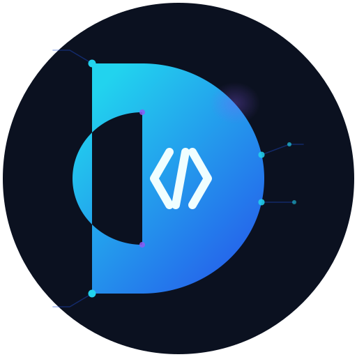

# DeepCode Agent

[中文说明](README.zh-CN.md)

AI-powered software engineering assistant for planning, coding, reviewing, testing, platform chat bridging, and web-based runtime operations.

[](https://www.python.org)
[](LICENSE)
[](https://github.com/lifeislikeaboat567/DeepCode/releases)

## Documentation

| Document | Description |
|----------|-------------|
| [AI Agent 调研报告](docs/01_research_report.md) | Survey of popular AI agents and coding-agent product directions |
| [功能设计与技术路线](docs/02_design_document.md) | Functional specification and technical architecture |
| [软件开发文档](docs/03_development_document.md) | Development phases, milestones, and acceptance criteria |
| [OpenClaw 与 Claude Code 功能调研（V2）](docs/04_openclaw_claude_code_feature_research.md) | Capability-domain research baseline for the next-generation product |
| [DeepCode V2 功能与界面蓝图](docs/05_deepcode_v2_feature_and_ui_blueprint.md) | Product blueprint, interaction design, and target architecture |
| [DeepCode V2 迭代路线图](docs/06_iteration_roadmap.md) | Iteration roadmap and milestone planning |
| [DeepCode V2 执行清单](docs/07_execution_checklist.md) | Implementation checklist for execution tracking |

## Features

- Multi-agent architecture: orchestrator, coding, review, testing, and tool-routing collaboration
- End-to-end engineering loop: plan -> code -> execute -> review -> test
- CLI control plane: doctor, run, session/task/artifact management, governance, extension registry
- REST API with OpenAPI docs, streaming chat, task orchestration, and health endpoints
- Platform bridge: unified inbound normalization for generic, QQ, WeChat, and Feishu
- QQ dual delivery path: official bot API + official Gateway listener, or NapCat / OneBot send_msg callback delivery
- Web console built on Reflex for runtime operations, configuration, governance, and extension management
- Persistent state: SQLite runtime data and vector memory integration
- Governance and audit trail for critical runtime operations
- Multi-LLM provider support: OpenAI, Ollama, and mock mode for local testing

## Release

Current stable version: 0.2.0

## Quick Start

### Prerequisites

- Python 3.11+
- Node.js available for Reflex frontend build
- An OpenAI-compatible API key, or a local Ollama runtime, or mock provider for testing

### Install From GitHub Release / Tag

```bash
# pip
pip install "deepcode @ git+https://github.com/lifeislikeaboat567/DeepCode.git@v0.2.0"

# uv pip
uv pip install "deepcode @ git+https://github.com/lifeislikeaboat567/DeepCode.git@v0.2.0"

# install CLI globally with uv
uv tool install git+https://github.com/lifeislikeaboat567/DeepCode.git@v0.2.0
```

### Install For Development

```bash
git clone https://github.com/lifeislikeaboat567/DeepCode.git
cd DeepCode
pip install -e ".[dev]"
copy .env.example .env
```

Then edit `.env` and set at least:

```bash
DEEPCODE_LLM_PROVIDER=openai
DEEPCODE_LLM_MODEL=gpt-4o-mini
DEEPCODE_LLM_API_KEY=sk-...
```

### Verify Installation

```bash
deepcode --version
deepcode doctor
```

## CLI Usage

```bash
# fallback entry if deepcode is not on PATH
python -m deepcode doctor

# environment diagnosis
deepcode doctor

# interactive chat
deepcode chat

# run a multi-agent engineering task
deepcode run "Build a Python binary search tree with tests"

# run with parallel coding stage
deepcode run --parallel-workers 3 "Build a TODO API with tests"

# runtime data views
deepcode task list
deepcode session list
deepcode artifact list

# extensions and governance
deepcode extension mcp list
deepcode extension skill list
deepcode governance audit-list

# stream reasoning output
deepcode run --stream "Build a REST API for a todo list"

# start API server
deepcode serve

# manage official QQ gateway listener
deepcode qqgateway start
deepcode qqgateway status
deepcode qqgateway stop

# start standalone NapCat inbound listener
deepcode napcat -p 18000

# or manage inbound listener lifecycle explicitly
deepcode inbound start --port 18000
deepcode inbound status
deepcode inbound stop

# launch Reflex web UI
deepcode ui
```

## QQ Integration (Official Bot + NapCat)

DeepCode 0.2 supports two QQ outbound delivery modes:

- `official`: reply through QQ official bot OpenAPI
- `napcat`: reply through NapCat / OneBot `send_msg`

In this update, official QQ Bot supports AppID + AppSecret credentials and an official Gateway listener process.

### Official QQ Bot Quick Start (AppID + AppSecret)

### Step 1: Configure Environment Variables

```bash
DEEPCODE_CHAT_BRIDGE_ENABLED=true
DEEPCODE_CHAT_BRIDGE_ALLOWED_PLATFORMS=qq
DEEPCODE_CHAT_BRIDGE_DEFAULT_MODE=agent

# enable async callback delivery back to QQ
DEEPCODE_CHAT_BRIDGE_CALLBACK_DELIVERY_ENABLED=true

# QQ outbound via Official Bot API
DEEPCODE_CHAT_BRIDGE_QQ_DELIVERY_MODE=official
DEEPCODE_CHAT_BRIDGE_QQ_BOT_APP_ID=<your_app_id>
DEEPCODE_CHAT_BRIDGE_QQ_BOT_APP_SECRET=<your_app_secret>

# optional: explicit Ed25519 verification secret for webhook signature checks
DEEPCODE_CHAT_BRIDGE_QQ_SIGNING_SECRET=
```

Notes:

- `DEEPCODE_CHAT_BRIDGE_QQ_BOT_APP_ID` + `DEEPCODE_CHAT_BRIDGE_QQ_BOT_APP_SECRET` are the primary official credentials.
- DeepCode exchanges these credentials for `access_token` automatically.
- If `DEEPCODE_CHAT_BRIDGE_QQ_SIGNING_SECRET` is empty, DeepCode falls back to AppSecret for QQ signature verification.

### Step 2: Open Official Gateway Listener

Use the built-in QQ gateway lifecycle commands:

```bash
deepcode qqgateway start
deepcode qqgateway status
deepcode qqgateway stop
```

Fallback module entry:

```bash
python -m deepcode qqgateway start
python -m deepcode qqgateway status
python -m deepcode qqgateway stop
```

If you want to run in the foreground for debugging:

```bash
deepcode qqgateway run --skip-preflight
```

### Step 3: Validate Official Path

```bash
deepcode qqgateway status
deepcode qqgateway status --json-output
```

Expected signals:

- `running=true`
- `credentials_ready=true`
- log file path is present (for example: `~/.deepcode/qq_gateway_listener.log`)

### Step 4: Official Mode Troubleshooting

- `missing_credentials`: check `DEEPCODE_CHAT_BRIDGE_QQ_BOT_APP_ID` and `DEEPCODE_CHAT_BRIDGE_QQ_BOT_APP_SECRET`
- gateway reconnect loops: verify QQ Open Platform app status, network egress, and system clock
- inbound arrives but no reply: inspect `qq_gateway_listener.log` for `bridge_event_type` and `reply sent` logs

If your QQ bot stack is based on NapCat, use the configuration below.

### NapCat Quick Start

### Step 1: Configure Environment Variables

```bash
DEEPCODE_CHAT_BRIDGE_ENABLED=true
DEEPCODE_CHAT_BRIDGE_ALLOWED_PLATFORMS=qq
DEEPCODE_CHAT_BRIDGE_DEFAULT_MODE=agent

# enable async callback delivery back to QQ
DEEPCODE_CHAT_BRIDGE_CALLBACK_DELIVERY_ENABLED=true

# QQ outbound via NapCat / OneBot
DEEPCODE_CHAT_BRIDGE_QQ_DELIVERY_MODE=napcat
DEEPCODE_CHAT_BRIDGE_QQ_NAPCAT_API_BASE_URL=http://127.0.0.1:3000
DEEPCODE_CHAT_BRIDGE_QQ_NAPCAT_ACCESS_TOKEN=

# NapCat inbound callback validation
DEEPCODE_CHAT_BRIDGE_QQ_NAPCAT_WEBHOOK_TOKEN=

# API listener
DEEPCODE_API_HOST=0.0.0.0
DEEPCODE_API_PORT=8000
```

Notes:

- `DEEPCODE_CHAT_BRIDGE_CALLBACK_DELIVERY_ENABLED=true` is required, otherwise DeepCode can process the event but will not send the reply back to QQ.
- `DEEPCODE_CHAT_BRIDGE_QQ_NAPCAT_API_BASE_URL` should point to your NapCat HTTP API service.
- `DEEPCODE_CHAT_BRIDGE_QQ_NAPCAT_ACCESS_TOKEN` is optional and is used in the `Authorization` header when calling NapCat `send_msg`.
- `DEEPCODE_CHAT_BRIDGE_QQ_NAPCAT_WEBHOOK_TOKEN` is optional and should match the NapCat-side webhook token if validation is enabled.

### Step 2: Start The Listener

You can choose one of two deployment modes.

Mode A: run the full API service.

```bash
deepcode serve
```

NapCat callback URL:

```text
http://<your-host>:8000/api/v1/platforms/qq/events
```

Mode B: run the standalone NapCat inbound listener only.

```bash
deepcode napcat -p 18000
```

or

```bash
deepcode inbound start --port 18000
deepcode inbound status
```

NapCat callback URL:

```text
http://<your-host>:18000/api/v1/platforms/qq/events
```

### Step 3: Configure NapCat

On the NapCat side, verify the following:

- The HTTP callback URL points to DeepCode `/api/v1/platforms/qq/events`
- If webhook token validation is enabled, NapCat and DeepCode use the same token
- NapCat HTTP API is reachable from the DeepCode process
- The `/send_msg` API is available and works with the configured access token
- If the services run on different machines, firewall rules, NAT, reverse proxy, and port mappings are correct

### Step 4: Validate The End-To-End Path

CLI-side checks:

```bash
deepcode inbound status
deepcode inbound status --json-output
```

Recommended QQ-side smoke commands:

- `/ping`
- `/version`
- `/help`
- `/mode agent`
- `/plan 为 DeepCode 生成一个 0.2 版本发布检查清单`

### Step 5: Troubleshooting

- QQ receives the event but no reply is sent: check `DEEPCODE_CHAT_BRIDGE_CALLBACK_DELIVERY_ENABLED`
- NapCat `send_msg` returns 403: check `DEEPCODE_CHAT_BRIDGE_QQ_NAPCAT_ACCESS_TOKEN`
- Inbound request returns 401: check `DEEPCODE_CHAT_BRIDGE_QQ_NAPCAT_WEBHOOK_TOKEN`
- DeepCode produces a result but QQ still shows no response: inspect runtime logs and `platform_inbound_debug.log`
- Standalone inbound listener uses the wrong model: verify persisted `llm_*` runtime overrides were saved before the listener restarted

## Web UI Notice

DeepCode uses Reflex as the supported Web UI runtime.

- `deepcode/ui` is a deprecated compatibility shell only
- do not implement new UI features on Streamlit paths
- use `deepcode_reflex/` for runtime/state/UI changes and `deepcode/web_shared/` for shared web catalogs

## Mock Provider

```bash
DEEPCODE_LLM_PROVIDER=mock deepcode chat
```

## Ollama

```bash
ollama pull llama3
DEEPCODE_LLM_PROVIDER=ollama DEEPCODE_LLM_MODEL=llama3 deepcode chat
```

## Docker

```bash
docker-compose up
```

Services:

- API docs: http://localhost:8000/docs
- Reflex frontend: http://localhost:8501

## REST API

Start the service with `deepcode serve`, then open http://localhost:8000/docs.

### Key Endpoints

| Method | Path | Description |
|--------|------|-------------|
| `GET` | `/api/v1/health` | Health check |
| `POST` | `/api/v1/chat` | Single-turn chat |
| `GET` | `/api/v1/chat/stream` | Streaming chat over SSE |
| `POST` | `/api/v1/platforms/{platform}/events` | Platform webhook bridge for `generic`, `qq`, `wechat`, `feishu` |
| `POST` | `/api/v1/tasks` | Create an orchestrated task |
| `GET` | `/api/v1/tasks` | List recent tasks |
| `GET` | `/api/v1/tasks/{id}` | Poll task status |
| `DELETE` | `/api/v1/tasks/{id}` | Delete task |
| `POST` | `/api/v1/sessions` | Create a session |
| `GET` | `/api/v1/sessions` | List sessions |

### Generic Chat Request Example

```bash
curl -X POST http://localhost:8000/api/v1/chat \
  -H "Content-Type: application/json" \
  -d '{"message": "Write a Python function to reverse a string"}'
```

### Orchestrated Task Example

```bash
curl -X POST http://localhost:8000/api/v1/tasks \
  -H "Content-Type: application/json" \
  -d '{"task": "Build a calculator class with add, subtract, multiply, divide"}'

curl http://localhost:8000/api/v1/tasks/<task-id>
```

### Generic Platform Event Example

```bash
curl -X POST http://localhost:8000/api/v1/platforms/generic/events \
  -H "Content-Type: application/json" \
  -H "X-DeepCode-Bridge-Token: <optional-token>" \
  -d '{
    "user_id": "u-1001",
    "channel_id": "team-chat",
    "message_id": "evt-001",
    "text": "/plan Build a release checklist workflow"
  }'
```

Bridge command prefixes:

- `/ask ...` -> ask mode
- `/agent ...` -> agent mode
- `/plan ...` -> plan-only agent mode

Built-in local bridge commands:

- `/help`
- `/ping`
- `/version`
- `/config keys`
- `/config show [key]`
- `/config set <key> <value>`
- `/config reset <key>`
- `/config mode <ask|agent>`
- `/config profile list`
- `/config profile use <id|name>`
- `/mode <ask|agent>`
- `/skill list [all|enabled|disabled] [query]`
- `/skill show <name>`
- `/skill enable <name>`
- `/skill disable <name>`
- `/skill install <source>`
- `/skill uninstall <name>`
- `/inbound status`
- `/inbound start`
- `/inbound stop`

## Architecture

```text
deepcode/
├── agents/          Multi-agent orchestration and prompt layering
├── api/             FastAPI app, routes, platform bridge, NapCat listener
├── extensions/      Skills, hooks, MCP registry, remote installs
├── governance/      Approval store, policy engine, audit
├── llm/             Provider abstraction and client factories
├── memory/          Short-term and long-term memory logic
├── storage/         SQLite-backed state and runtime persistence
├── tools/           Shell, execution, file, and supporting tools
├── ui/              Deprecated compatibility shell
└── web_shared/      Shared web constants and translations

deepcode_reflex/
├── deepcode_reflex.py
└── state.py
```

## Testing

```bash
pytest
pytest --cov=deepcode --cov-report=term-missing
pytest tests/test_api.py -v
```

## Configuration

All settings use the `DEEPCODE_` prefix.

| Variable | Default | Description |
|----------|---------|-------------|
| `DEEPCODE_LLM_PROVIDER` | `openai` | LLM provider: `openai`, `ollama`, `mock` |
| `DEEPCODE_LLM_MODEL` | `gpt-4o-mini` | Model name |
| `DEEPCODE_LLM_API_KEY` | _(required for openai)_ | API key |
| `DEEPCODE_LLM_BASE_URL` | _(empty)_ | Custom API base URL |
| `DEEPCODE_API_PORT` | `8000` | API server port |
| `DEEPCODE_MAX_EXECUTION_TIME` | `30` | Code execution timeout in seconds |
| `DEEPCODE_ALLOWED_SHELLS` | `ls,cat,grep,...` | Allow-listed shell commands |
| `DEEPCODE_MAX_HISTORY_MESSAGES` | `50` | Conversation history window |
| `DEEPCODE_DATA_DIR` | `~/.deepcode` | Persistent data directory |
| `DEEPCODE_CHAT_BRIDGE_ENABLED` | `true` | Enable chat-platform webhook bridge |
| `DEEPCODE_CHAT_BRIDGE_VERIFY_TOKEN` | _(empty)_ | Optional shared token checked against `X-DeepCode-Bridge-Token` |
| `DEEPCODE_CHAT_BRIDGE_DEFAULT_MODE` | `ask` | Default mode when no prefix is present |
| `DEEPCODE_CHAT_BRIDGE_ALLOWED_PLATFORMS` | `generic,qq,wechat,feishu` | Allowed inbound platform IDs |
| `DEEPCODE_CHAT_BRIDGE_SIGNATURE_TTL_SECONDS` | `300` | Accepted signed webhook timestamp skew |
| `DEEPCODE_CHAT_BRIDGE_EVENT_ID_TTL_SECONDS` | `86400` | Event idempotency window |
| `DEEPCODE_CHAT_BRIDGE_FEISHU_ENCRYPT_KEY` | _(empty)_ | Feishu callback encrypt key |
| `DEEPCODE_CHAT_BRIDGE_WECHAT_TOKEN` | _(empty)_ | WeChat callback token |
| `DEEPCODE_CHAT_BRIDGE_QQ_SIGNING_SECRET` | _(empty)_ | QQ webhook signing secret |
| `DEEPCODE_CHAT_BRIDGE_CALLBACK_DELIVERY_ENABLED` | `false` | Enable outbound callback delivery to platform message APIs |
| `DEEPCODE_CHAT_BRIDGE_QQ_DELIVERY_MODE` | `auto` | QQ outbound mode: `auto`, `official`, `napcat` |
| `DEEPCODE_CHAT_BRIDGE_QQ_NAPCAT_API_BASE_URL` | `http://127.0.0.1:3000` | NapCat / OneBot HTTP API base URL |
| `DEEPCODE_CHAT_BRIDGE_QQ_NAPCAT_ACCESS_TOKEN` | _(empty)_ | Optional NapCat access token |
| `DEEPCODE_CHAT_BRIDGE_QQ_NAPCAT_WEBHOOK_TOKEN` | _(empty)_ | Optional NapCat inbound webhook token |

## Branding

The official DeepCode logo is located at [`assets/logo.svg`](assets/logo.svg).



**Design spec:**
- Background: dark navy circle (`#060C18` → `#0F1A2E` radial gradient)
- Symbol: geometric capital **D** with cyan to electric-blue to indigo gradient (`#22D3EE` to `#3B82F6` to `#6366F1`)
- Negative-space `</>` code symbol: cyan `<`, purple `/`, electric-blue `>`
- Accent: subtle neural-network nodes and circuit traces around the perimeter

The SVG is avatar-friendly and scales cleanly from 16 × 16 to full resolution. Use the vector file for all primary placements; export to PNG only when the target platform does not support SVG.

## License

MIT © DeepCode Team
